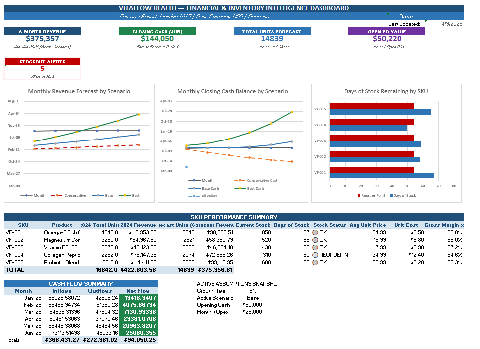
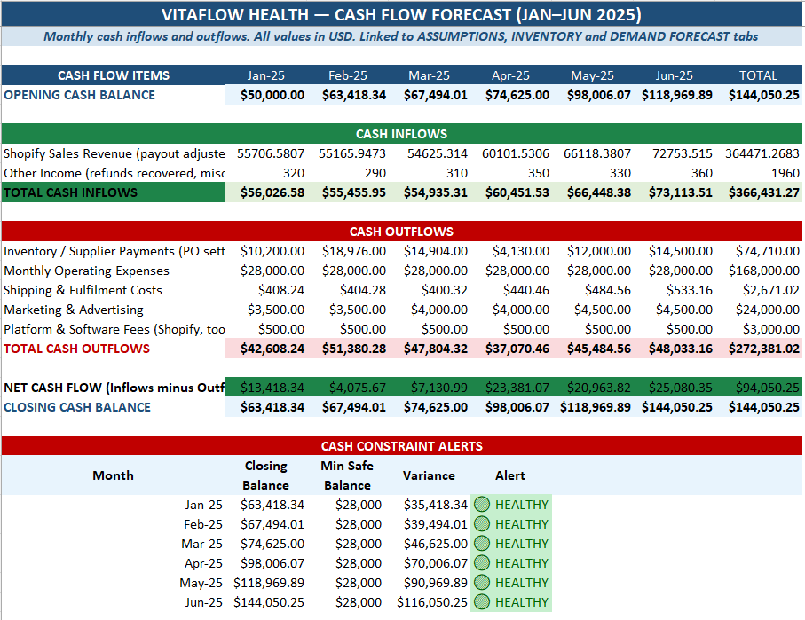
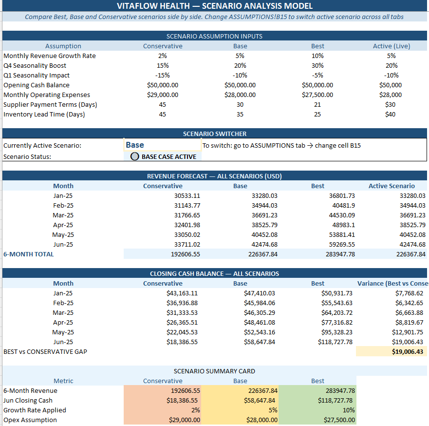

# 📊 eCommerce Inventory & Cash Flow Forecasting Model
**Client Type:** Health & Wellness eCommerce Brand (DTC)
**Tools Used:** Microsoft Excel (Advanced)
**Analyst:** Noah Ajekwemu — PhD Corporate Finance

## 🧾 Project Overview
This model was built to solve a critical business challenge for a 
fast-growing eCommerce brand: maintaining the right inventory levels 
while protecting cash flow during a high-growth phase.

The model integrates SKU-level inventory data, supplier purchase orders, 
sales demand forecasting, and cash flow projections into a single 
dynamic decision-making tool.

## 🎯 Business Problem Solved
- Leadership had no forward visibility on when SKUs would run out
- Cash flow surprises from overlapping supplier payments
- No way to model impact of different growth scenarios on inventory 
  and cash simultaneously

## ✅ What the Model Does

### 1. Inventory Forecasting
- Tracks current stock levels for 5 SKUs
- Models incoming purchase orders with landing dates
- Calculates days of stock remaining per SKU
- Flags stockout risks automatically with colour-coded alerts

### 2. Demand Forecasting
- Projects 6-month sales demand using historical trends
- Applies seasonality adjustments by quarter
- Dynamically updates when growth assumptions change

### 3. Cash Flow Projection
- Models monthly Shopify revenue inflows
- Schedules supplier payments based on PO terms
- Tracks operating expenses, shipping and marketing costs
- Projects weekly and monthly closing cash balance
- Alerts when cash falls below safe operating level

### 4. Scenario Modeling
- Three fully built scenarios: Conservative, Base, Best
- Single-cell scenario switcher updates entire model instantly
- Side-by-side revenue and cash balance comparison across scenarios

### 5. Executive Dashboard
- KPI cards: Revenue, Cash Balance, Units Forecast, PO Value, Alerts
- Revenue forecast chart (3 scenario lines)
- Cash balance trend chart with minimum safe level indicator
- SKU performance table with gross margin %
- Cash flow summary with live conditional formatting

## 📁 Model Structure

| Tab             | Purpose |
|-----------------|---------|
| DASHBOARD       | Executive summary — start here |
| ASSUMPTIONS     | All inputs in one place |
| SALES DATA      | 12 months historical units and revenue |
| INVENTORY       | Current stock, POs, reorder alerts |
| DEMAND FORECAST | 6-month SKU-level projections |
| CASH FLOW       | Monthly inflows, outflows, balance |
| SCENARIOS       | Best / Base / Conservative comparison |

## 📸 Screenshots

### Dashboard

### Cash Flow Forecast

### Scenario Analysis

## 💡 Key Formulas & Techniques Used
- Dynamic scenario switching with nested IF logic
- VLOOKUP for cross-tab price and cost references
- SUMIF for PO aggregation by SKU
- Conditional formatting for traffic light alerts
- Rolling cash balance with forward-linked opening balances
- Seasonality multipliers driven from central assumptions

## 📬 Hire Me
I build financial models, dashboards and data analysis tools 
for eCommerce, DTC brands, and SMEs.

- 📧 Available for freelance projects via Upwork and direct engagement
- 🎓 PhD Corporate Finance — Rivers State University (2025)
- 🛠 Tools: Excel, Power BI, MySQL, QuickBooks
- 🌍 Based in Nigeria — available for remote work worldwide
